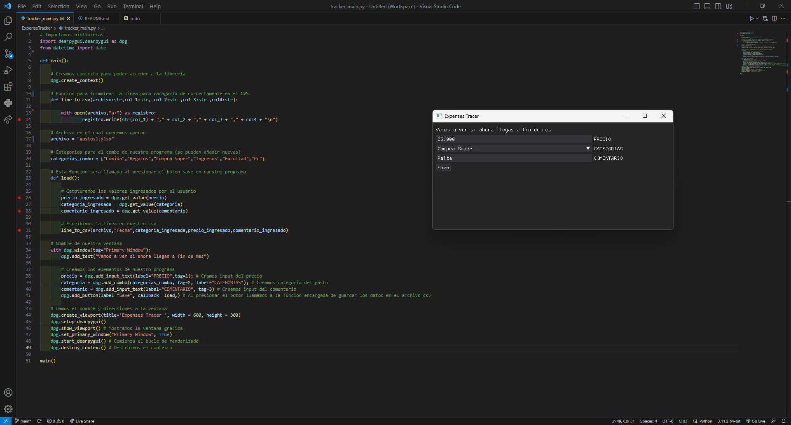

# ExpenseTracker
# Este proyecto se me ocurrio debido a que no sabia en que carajos estaba gasando la plata 
# Lo iba a hacer con mi amigo al que le regale el Macro-Pad (revisar mi repositorio que tiene ese nombre) pero me dejo tirado
# Ya esta funcional pero le voy agregando mas features cuando puedo. 
# Utilice : dearpygui, datetime y manejo de archivos (CSV)

### PREVIEW DEL PROYETO 👀 ##
